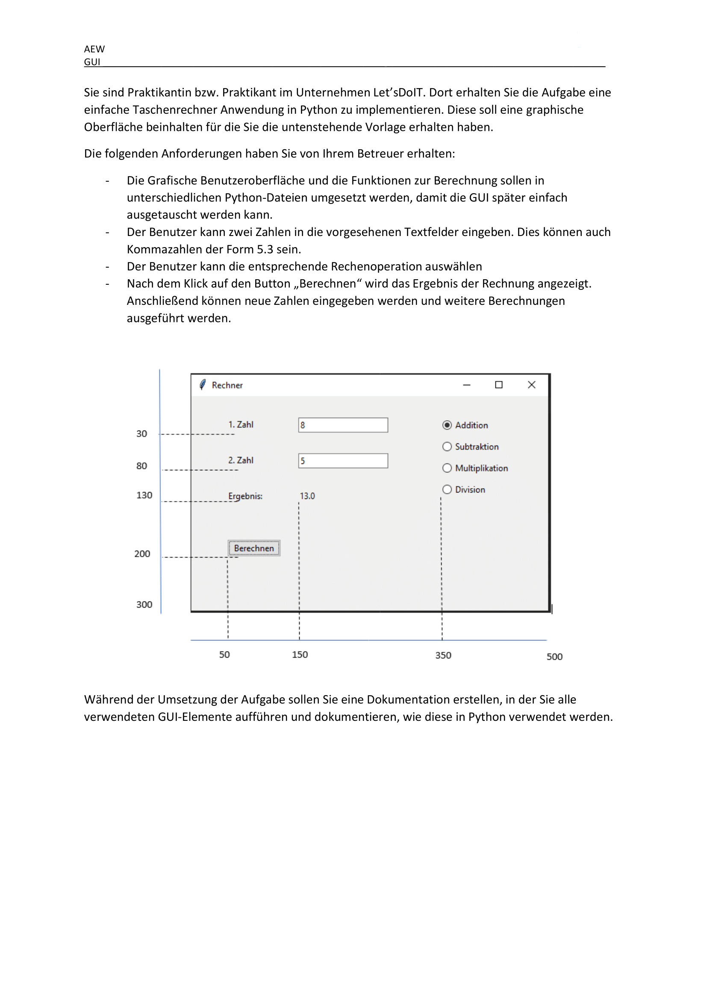

# Dokumentation

## Inhalt

1. [Einleitung](#einleitung)

2. [Installation](#installation)

3. [Verwendung](#verwendung)

4. [Funktionen](#funktionen)

5. [UI-Elemente](#ui-elemente)

6. [Aufgabenstellung](#aufgabenstellung)

7. [Lizenz](#lizenz)

## Einleitung

Das hier ist eine Aufgabe, die ich von der Schule bekommen habe. Ich soll ein Taschenrechner machen, der die vier Grundrechenarten kann und man 2 Zahlen eingeben kann. Ich hab das ganze nen wenig komplexer gemacht und hab noch ein paar Funktionen hinzugefügt.

## Installation

Um das Programm auszuführen braucht ihr Python (3.12.X).

Außerdem braucht ihr dieses Python Package:
    
```bash
pip install customtkinter
pip install tkextrafont
```

## Verwendung

Um das Programm zu starten, führt die `main.py` Datei aus.

## Funktionen

### main.py

Die `main.py` Datei enthält die `main()` Funktion, die das Programm startet.

```python
main()
```
Startet das Programm.

### ui.py

Die `ui.py` Datei enthält alle Funktionen, die das User Interface betreffen.

```python
clear_site()
```
Leert die Seite.

```python
create_widgets()
```
Erstellt die Widgets. Wie z.B. die Buttons und das Entry Felder.

```python
button_click(value)
```
Wird ausgeführt, wenn ein Button geklickt wird und fügt den Wert des Buttons in das Entry Feld ein.

```python
clear()
```
Löscht den Inhalt des Entry Feldes.

```python
calculate()
```
Versucht das eingebebene zu berechnen und gibt das Ergebnis aus. Es nutzt die calc.py Datei.

### calc.py

Die `calc.py` Datei enthält alle Funktionen, die das Rechnen betreffen.

```python
calculate(equation)
```
Berechnet die Aufgabe und gibt das Ergebnis zurück.

## UI-Elemente

### Entry Feld

Das Entry Feld ist das Feld, in dem die Zahlen eingegeben werden und das Ergebnis angezeigt wird.

### Buttons

Die Buttons sind die Knöpfe mit den Zahlen und den Rechenzeichen.

## Aufgabenstellung




## Lizenz

Das Projekt nutzt die [MIT](https://choosealicense.com/licenses/mit/)-Lizenz.


